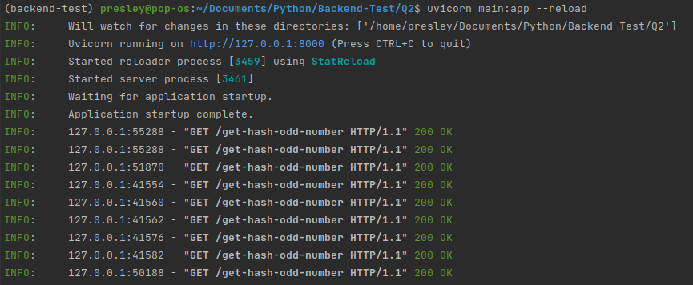
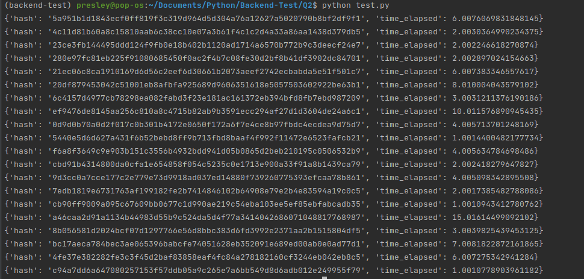
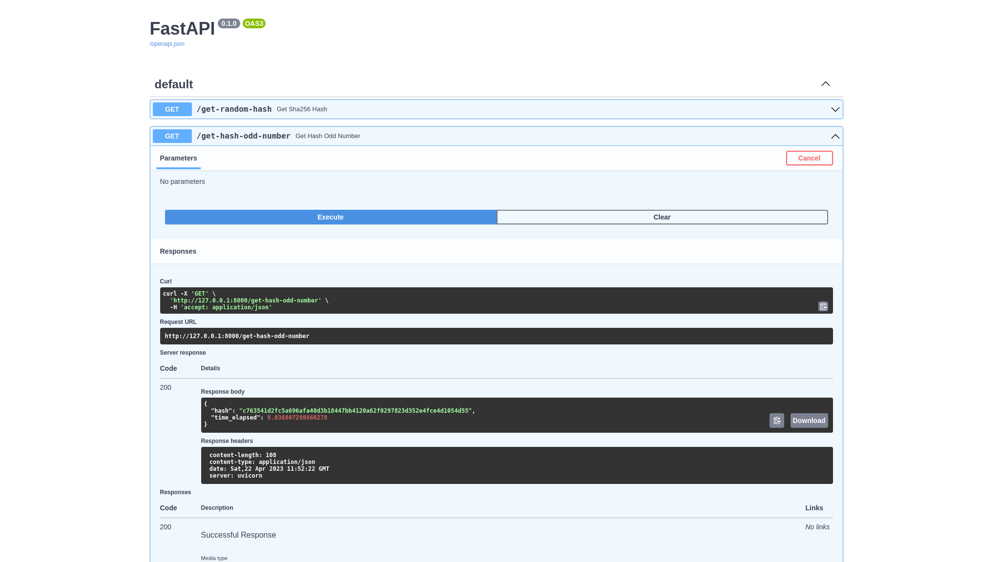

## Question 1

### How to run:

- python main.py

## Question 2

### Endpoint #1
- [Get Random Hash] : `GET /get-random-hash`

### Endpoint #2
- [Get Odd Number Random Hash] : `GET /get-hash-odd-number`

### How to run API Service for a Random Hash Machine(RHM):
- uvicorn main:app --reload

### How to run load Test:
- python LoadTest.py

### How to run FastAPI UI:
- http://127.0.0.1:8000/docs

